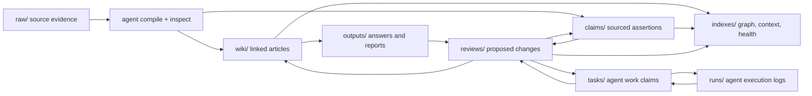

# kforge

`kforge` is an open, local-first, Markdown-first repo protocol and CLI for
LLM-maintained knowledge bases.

It turns source folders into reviewable knowledge repos that humans, Obsidian,
Git, local scripts, and LLM agents can all understand.

The short version:

> Git for knowledge. CI for truth. Obsidian as IDE. LLM as compiler.

Use it when you want AI research work to accumulate as files instead of
vanishing into chat transcripts:

```text
raw evidence -> agent draft -> review -> wiki/claims -> health checks
```

`kforge` is not a RAG framework, not an Obsidian plugin, not a hosted AI app,
and not a model wrapper. It is the filesystem contract and deterministic tool
layer underneath those interfaces: provider-neutral, Git-friendly, MCP-ready,
and usable without a vector database.

The first release proves one loop:

```bash
kforge demo ./kforge-demo
cd ./kforge-demo
kforge agent next . --agent local-agent --json
kforge agent step . --agent local-agent --json
kforge agent draft . --agent local-agent --json
```

That loop claims one review-backed task, gives the agent a work packet, writes
an editable draft into `outputs/`, and points to the review writeback command.



Plain text fallback: `raw/` evidence becomes `wiki/` pages, `claims/`,
`outputs/`, `reviews/`, `tasks/`, and `runs/`, then deterministic `indexes/` make the repo
inspectable again.

`kforge` is the repo contract and deterministic tool layer in that loop.
Obsidian can be the reading interface, Codex or Claude Code can be the agent,
Git can be the history, and `kforge` keeps the shared filesystem state
inspectable.

## Positioning

Use `kforge` when you want durable Markdown knowledge that an agent can maintain
without hiding the evidence trail.

Do not use `kforge` as a replacement for Obsidian, Notion, Dify, AnythingLLM,
GraphRAG, LangChain, or LlamaIndex. Those tools can be interfaces, app
platforms, assistants, retrieval systems, or orchestration layers. `kforge` is
the local repo protocol underneath: raw evidence, compiled wiki pages, sourced
claims, review artifacts, generated outputs, and deterministic health checks.

See [docs/comparison.md](docs/comparison.md) for a more detailed boundary map.

## Why

Most AI knowledge tools stop at chat over documents. That is useful, but the
answer disappears after the session.

`kforge` treats research as a durable repository:

- humans collect source material
- LLM agents compile it into a linked Markdown wiki
- every important claim stays traceable to source evidence
- every query, report, chart, or slide deck can be filed back into the repo
- health checks find broken links, unsourced pages, drift, and review debt
- existing generated indexes are checked for drift against current repo files

The goal is not another note-taking app. The goal is a shared filesystem
contract that Obsidian, Codex, Claude Code, local models, MCP tools, and plain
shell scripts can all understand.

## What You Can Do

- ingest local source files into `raw/` with metadata
- inspect sources, outputs, wiki pages, claims, and reviews before reading them
  in full
- generate context, search results, answer packs, task packs, and compile briefs
  without calling a model
- stage broad or risky changes through review artifacts
- promote useful outputs into reviewable wiki or claim updates
- bootstrap a newly ingested research repo into compile reviews, seeded tasks,
  refreshed indexes, and optional agent runs
- seed and claim review work as tasks so multiple agents can coordinate
- pre-plan independent runs for several agents from the same review queue
- generate or execute a shell launcher that starts several agent workers in
  parallel from those planned runs
- inspect a shared agent board for active runs, claimed tasks, and gaps
- record auditable agent runs with logs and success/failure status
- run deterministic health checks and trust score reports
- audit claim provenance, status, confidence, source drift, and review debt
- expose the same operations to agents through a stdio MCP server

## Status

Early prototype. The first release focuses on the repo contract and deterministic
tools that do not require an LLM provider:

- initialize a knowledge repo
- create the canonical directory layout
- copy local source files into `raw/` with metadata sidecars
- batch-import local source directories into `raw/`
- inventory raw sources, wiki pages, and claims
- create sourced claim files
- audit claim provenance and review debt
- create review artifacts for risky agent edits
- list and inspect generated outputs before promoting them
- promote useful outputs into reviewable wiki or claim updates
- seed review work into `tasks/` and claim it for parallel agent runs
- record agent execution logs under `runs/`
- generate an agent context pack
- generate an agent workflow runbook
- install Codex, Claude Code, Cursor, and generic agent instruction templates
- generate a deterministic wiki graph with backlinks and orphan pages
- generate a deterministic raw-to-wiki compile plan, including JSON output for
  automation
- stage queued raw sources as proposed compile reviews, including JSON output
  for automation
- bootstrap queued source material into reviews, tasks, refreshed dashboards,
  and optional multi-agent run assignments
- generate source-to-wiki compile briefs for LLM handoff
- generate provider-neutral answer packs for questions
- print or write trust score reports
- search local text files without a vector database
- inspect one file before reading it in full
- generate agent task packs for LLM handoff
- expose repo operations through a stdio MCP server
- plan multiple independent agent runs from one review queue
- generate a parallel agent launch script, or execute it when a worker command
  template is configured
- inspect multi-agent board state and coordination gaps
- preview and repair recoverable agent coordination drift from CLI, MCP, or Web
- run a localhost web dashboard for repo status, review queues, task queues,
  running agents, and safe workflow actions
- run structural health checks for links and local source references
- validate the `kb.yaml` protocol manifest
- detect stale generated index files after repo changes
- provide agent instructions for safe wiki maintenance

LLM compile, query, review, and provenance tooling will layer on top of this
base instead of replacing it.

## Implementation

`kforge` is TypeScript-first and runs on Node.js. The core stays dependency-light
and provider-neutral so it can work inside Obsidian-adjacent workflows, agent
CLIs, MCP tools, and plain shell automation without requiring Python, a vector
database, or a hosted model.

Rust is a future optional acceleration layer for measured hotspots such as
large-repo indexing or search. It should not be required for the baseline CLI,
MCP server, or repo protocol. Python is intentionally not part of the
implementation stack; `.py` files may still be indexed as source evidence when a
knowledge repo contains code.

The release checks enforce this stance with `npm run check:stack`, which fails
if Python implementation files, Python packaging manifests, or Python runtime
commands enter the project core. Rust experiments should stay optional until a
profiled hotspot justifies them.

CI runs `npm test`, `npm run smoke`, and `npm pack --dry-run`. The smoke script
exercises the real CLI over temporary repos, including compile plan/review JSON,
review queues, task claiming, output promotion, review application, doctor JSON,
MCP help, and the package entrypoint.

## Knowledge Repo Layout

```text
raw/        original source documents, images, repos, datasets, captures
wiki/       LLM-compiled Markdown articles intended for human reading
claims/     important claims with source references and review state
indexes/    generated maps, inventories, brief summaries, backlinks
outputs/    answers, reports, charts, slides, and other generated artifacts
reviews/    proposed edits and unresolved review items
tasks/      claimable work items for parallel agents
runs/       auditable agent execution logs
```

See [docs/protocol.md](docs/protocol.md) for the working protocol.

See [docs/vision.md](docs/vision.md) for the long-term product thesis and
implementation stance.

Browse [examples/demo-repo](examples/demo-repo) to see a complete tiny kforge
knowledge repo with raw evidence, wiki pages, claims, reviews, outputs, and
generated indexes.

For a copy-pasteable repo-state loop, start with the
[ten-minute agent draft walkthrough](docs/examples.md#ten-minute-agent-draft-walkthrough).

## Install

From npm after publication:

```bash
npm install -g kforge
kforge version
```

From a checkout:

```bash
npm install
npm run build
npm link
kforge version
```

This package requires Node.js 20 or newer.

## 30-Second Demo

Create a demo repo with sample content:

```bash
kforge demo ./kforge-demo
cd ./kforge-demo
```

Try the agent workflow:

```bash
kforge dashboard .
kforge context .
kforge workflow .
kforge agent next . --agent local-agent --json
kforge agent step . --agent local-agent --json
kforge agent draft . --agent local-agent --json
kforge agent list
kforge score .
kforge graph .
kforge compile . --source raw/llm-knowledge-bases.md --target wiki/Provenance.md
kforge search . --query provenance
kforge inspect . --file wiki/Provenance.md
kforge pack . --task "Explain the demo repo" --query provenance --file wiki/Provenance.md
kforge doctor .
```

For a fresh research repo with raw sources waiting to be compiled, start the
review-first pipeline in one pass:

```bash
kforge bootstrap . --dry-run --json
kforge bootstrap . --agent agent-a --agent agent-b --json
```

`bootstrap` stages queued raw sources as compile reviews, refreshes deterministic
indexes, seeds review-backed tasks, and optionally starts one auditable run per
agent. It does not write compiled wiki pages directly.

See [docs/quickstart.md](docs/quickstart.md) for the guided overview, or the
[ten-minute walkthrough](docs/examples.md#ten-minute-agent-draft-walkthrough)
for a concrete task/run/draft/review/apply loop.

## Common Commands

Add source files under `raw/`, then refresh deterministic indexes and reports:

```bash
kforge source add ~/research/my-topic \
  --file ~/Downloads/article.md \
  --title "Important Article" \
  --url "https://example.com/article"

kforge source fetch ~/research/my-topic \
  --url "https://example.com/article" \
  --title "Important Article"

kforge source fetch-list ~/research/my-topic \
  --file ~/Downloads/urls.txt \
  --title-prefix "Project A" \
  --dry-run

kforge source import ~/research/my-topic \
  --dir ~/Downloads/research-folder \
  --title-prefix "Project A" \
  --dry-run

kforge source import ~/research/my-topic \
  --dir ~/Downloads/research-folder \
  --title-prefix "Project A"

kforge source list ~/research/my-topic
kforge source inspect ~/research/my-topic --file raw/important-article.md
kforge refresh ~/research/my-topic
```

Automation can add `--json` to `source add`, `source fetch`,
`source fetch-list`, or `source import` to get the created `raw/` and
`raw/_meta/` paths, fetched response metadata, import counts, and dry-run plans
as a single machine-readable payload.

Start the research workflow from newly ingested raw sources:

```bash
kforge bootstrap ~/research/my-topic --dry-run --json
kforge bootstrap ~/research/my-topic \
  --agent agent-a \
  --agent agent-b \
  --json
```

This creates review artifacts for queued sources, refreshes repo status, seeds
claimable tasks, and starts optional agent runs. The wiki still changes only
after a draft is attached to a review, accepted, and applied.

Create a source-grounded claim:

```bash
kforge claim new ~/research/my-topic \
  --title "LLM-maintained wikis need provenance" \
  --source raw/example.md \
  --assertion "Compiled wiki pages are safer when important claims cite source files."

kforge claim audit ~/research/my-topic --write
kforge claim review-drift ~/research/my-topic --dry-run
```

Create a review artifact before a large wiki change:

```bash
kforge review new ~/research/my-topic \
  --title "Compile a provenance article" \
  --target wiki/Provenance.md \
  --source raw/example.md \
  --kind compile \
  --summary "Propose a small sourced article before editing the wiki."
```

Find the next review work:

```bash
kforge review queue ~/research/my-topic
kforge review next ~/research/my-topic
```

Let an agent claim one review task and create an editable draft:

```bash
kforge agent next ~/research/my-topic --agent local-agent --json
kforge agent step ~/research/my-topic --agent local-agent --json
kforge agent draft ~/research/my-topic --agent local-agent --json
```

Plan independent work packets for several agents:

```bash
kforge agent plan ~/research/my-topic \
  --agent agent-a \
  --agent agent-b \
  --agent agent-c \
  --json
```

This sequentially claims different open tasks, starts one auditable run per
assigned agent, and prints the `agent step` command each worker should run next.

If a long-running worker exits early, inspect and repair recoverable
coordination drift:

```bash
kforge agent board ~/research/my-topic --json
kforge agent reconcile ~/research/my-topic --write --json
```

Generate a parallel launcher for those workers:

```bash
kforge agent launch ~/research/my-topic \
  --agent agent-a \
  --agent agent-b \
  --agent agent-c \
  --command 'codex exec --prompt {prompt}' \
  --write \
  --json
```

The launcher is a provider-neutral shell script under `runs/`. It substitutes
`{agent}`, `{task}`, `{run}`, `{prompt}`, `{log}`, and `{repo}` in the command
template, starts each worker in the background, and writes one log per worker.
Add `--exec` when you want `kforge` to run the generated launcher immediately.

Edit the generated `outputs/...-draft.md`, then attach it to the review:

```bash
kforge review content ~/research/my-topic \
  --file reviews/2026-05-28-compile-a-provenance-article.md \
  --from outputs/provenance-draft.md

kforge review status ~/research/my-topic \
  --file reviews/2026-05-28-compile-a-provenance-article.md \
  --status accepted \
  --note "Source references and target path look correct."
```

If the review includes a `## Proposed Content` fenced Markdown block, apply it:

```bash
kforge review apply ~/research/my-topic \
  --file reviews/2026-05-28-compile-a-provenance-article.md

kforge agent finish ~/research/my-topic \
  --agent local-agent \
  --status success \
  --task-done \
  --note "Filed reviewed draft."
```

Promote a useful generated output back into the review flow:

```bash
kforge promote ~/research/my-topic \
  --file outputs/2026-05-28-answer.md \
  --target wiki/Answer.md \
  --source raw/example.md
```

Add `--json` to `output list`, `output inspect`, or `promote` when an agent
needs structured output refs, source refs, review refs, and next commands.

Print an agent context pack:

```bash
kforge context ~/research/my-topic
```

Or write it into the repo:

```bash
kforge context ~/research/my-topic --write
```

Print the recommended agent workflow:

```bash
kforge workflow ~/research/my-topic
```

Or save the workflow runbook into `indexes/`:

```bash
kforge workflow ~/research/my-topic --write
```

Write an Obsidian vault home note:

```bash
kforge obsidian ~/research/my-topic --write
kforge obsidian ~/research/my-topic --bridge --write
```

The bridge writes `.obsidian/kforge/commands.md` and
`.obsidian/kforge/commands.json` so an Obsidian command palette helper, shell
commands plugin, or local agent can discover the common `kforge` workflows.

Open the local web dashboard:

```bash
kforge web ~/research/my-topic
```

The web dashboard binds to `127.0.0.1` by default. It shows repo health, file
navigation, review queue, task queue, runs, active agents, safe review file
previews, and low-risk workflow actions such as saving Proposed Content,
accepting or rejecting reviews, previewing review apply as a dry run, explicitly
applying accepted reviews, previewing or applying recoverable agent reconcile,
URL source ingest, local search with open-in-preview results, writing answer
packs into outputs, refresh, bootstrap, planning multi-agent runs, and writing
an agent launcher. Generated outputs can also be inspected and promoted into
review artifacts from the dashboard.

Search the repo:

```bash
kforge search ~/research/my-topic --query "provenance" --scope wiki --limit 5
kforge search ~/research/my-topic --query "provenance" --scope wiki --json
```

Read the wiki graph:

```bash
kforge graph ~/research/my-topic --write
```

Inspect a file before reading it in full:

```bash
kforge inspect ~/research/my-topic --file wiki/Provenance.md
```

Generate a source-to-wiki compile brief:

```bash
kforge compile plan ~/research/my-topic --write
kforge compile plan ~/research/my-topic --json
kforge compile review ~/research/my-topic --dry-run --json
kforge compile review ~/research/my-topic --limit 3

kforge compile ~/research/my-topic \
  --source raw/example.md \
  --target wiki/Example.md \
  --write
```

Generate an agent task pack:

```bash
kforge pack ~/research/my-topic \
  --task "Explain the provenance model" \
  --query "provenance source references" \
  --file wiki/Provenance.md
```

Create a question-focused answer pack:

```bash
kforge ask ~/research/my-topic \
  --question "How does provenance affect trust?" \
  --query "provenance source references" \
  --file wiki/Provenance.md \
  --write
```

Inspect generated outputs before promoting them:

```bash
kforge output list ~/research/my-topic --json
kforge output inspect ~/research/my-topic --file outputs/2026-05-28-answer-pack.md --json
```

Check the repo and save a doctor report:

```bash
kforge refresh ~/research/my-topic
```

Run the MCP server for an agent client:

```bash
kforge-mcp ~/research/my-topic
```

## Documentation

- [Quickstart](docs/quickstart.md)
- [Five-minute tutorial](docs/tutorial.md)
- [Vision](docs/vision.md)
- [Architecture](docs/architecture.md)
- [Protocol](docs/protocol.md)
- [MCP Server](docs/mcp.md)
- [Agent templates](docs/agent-templates.md)
- [Examples](docs/examples.md)
- [Comparison](docs/comparison.md)
- [Roadmap](docs/roadmap.md)
- [Contributing](CONTRIBUTING.md)
- [Security](SECURITY.md)
- [Code of Conduct](CODE_OF_CONDUCT.md)
- [Changelog](CHANGELOG.md)
- [Release checklist](docs/release-checklist.md)

## CLI

```text
kforge init [path] [--force] [--example]
                         create a knowledge repo
kforge demo [path] [--force]
                         create a ready-to-browse demo repo
kforge bootstrap [path] [--agent <name>] [--limit <n>] [--dry-run] [--json]
                         stage compile reviews, tasks, and optional agent runs
kforge index [path]     generate source, wiki, claim, and review indexes
kforge refresh [path]   refresh indexes and derived reports
kforge doctor [path] [--write] [--json]
                         run structural health checks
kforge score [path] [--write]
                         print or write a trust score report
kforge context [path] [--write]
                         print or write an agent context pack
kforge dashboard [path] [--write] [--json]
                         print or write an Obsidian-friendly status dashboard
kforge obsidian [path] [--write] [--bridge] [--json] print/write an Obsidian entry or command bridge
kforge handoff [path] [--write]
                         print or write an agent handoff packet
kforge workflow [path] [--write]
                         print or write an agent workflow runbook
kforge graph [path] [--write]
                         print or write wiki backlinks and orphan report
kforge web [path] [--host <host>] [--port <n>]
                         run a local web dashboard
kforge agent next [path] --agent <name> [--limit <n>] [--no-seed] [--note <text>] [--json]
                         claim next task and start a run
kforge agent step [path] --agent <name> [--limit <n>] [--no-seed] [--note <text>] [--json]
                         create one agent work packet
kforge agent draft [path] --agent <name> [--run <runs/file.md>] [--json]
                         create a compile draft for current work
kforge agent status [path] --agent <name> [--json]
                         show current work for one agent
kforge agent board [path] [--json]
                         show active agents, runs, tasks, and coordination gaps
kforge agent reconcile [path] [--write] [--json]
                         reconcile recoverable agent coordination gaps
kforge agent plan [path] --agent <name> --agent <name> [--limit <n>] [--no-seed] [--note <text>] [--json]
                         assign independent runs to multiple agents
kforge agent launch [path] --agent <name> --agent <name> [--command <template>] [--write] [--exec] [--json]
                         generate or run a parallel worker launcher
kforge agent finish [path] --agent <name> [--run <runs/file.md>] [--status <success|failure>] [--task-done] [--note <text>] [--json]
                         finish the current agent run
kforge agent list        list installable agent instruction templates
kforge agent print [--template <name>]
                         print an agent instruction template
kforge agent install [path] [--template <name>] [--force]
                         install an agent instruction template
kforge compile [path] --source <path> --target <wiki/page.md> [--title <title>] [--write]
                         create a source-to-wiki compile brief
kforge compile plan [path] [--write] [--json]
                         print or write raw-to-wiki compile queue
kforge compile review [path] [--limit <n>] [--dry-run] [--json]
                         create compile review artifacts from queued raw sources
kforge compile draft [path] [--review <reviews/file.md>|--source <path> --target <wiki/page.md>] [--write] [--json]
                         create a wiki draft template for a compile review
kforge ask [path] --question <text> [--query <text>] [--file <repo-path>] [--write] [--json]
                         create an answer pack for a question
kforge search [path] --query <text> [--scope <scope>] [--limit <n>] [--json]
                         search local text files
kforge inspect [path] --file <repo-path>
                         inspect one repo-local file
kforge pack [path] --task <text> [--query <text>] [--file <repo-path>] [--write]
                         create an agent task pack
kforge promote [path] --file <outputs/file> --target <wiki/page.md|claims/file.md> [--source <path>] [--json]
                         promote an output into a review artifact
kforge output list [path] [--json]
                         list generated outputs
kforge output inspect [path] --file <outputs/file> [--json]
                         inspect one generated output
kforge task seed [path] [--limit <n>] [--json]
                         seed tasks from review queue
kforge task list [path] [--status <open|claimed|done|all>] [--json]
                         list parallel agent tasks
kforge task claim [path] [--task <tasks/file.md>] --agent <name> [--json]
                         claim the next or selected task
kforge task next [path] --agent <name> [--limit <n>] [--no-seed] [--json]
                         seed if needed and claim next task
kforge task done [path] --task <tasks/file.md> [--note <text>] [--json]
                         mark a task done
kforge task release [path] --task <tasks/file.md> [--note <text>] [--json]
                         release a claimed task
kforge run start [path] --task <tasks/file.md> --agent <name> [--note <text>] [--json]
                         start an auditable agent run
kforge run next [path] --agent <name> [--limit <n>] [--no-seed] [--note <text>] [--json]
                         claim next task and start a run
kforge run list [path] [--status <running|success|failure|all>] [--json]
                         list agent runs
kforge run inspect [path] --run <runs/file.md> [--json]
                         inspect one agent run
kforge run log [path] --run <runs/file.md> --message <text> [--json]
                         append to a run log
kforge run finish [path] --run <runs/file.md> --status <success|failure> [--note <text>] [--json]
                         finish a run
kforge source add [path] --file <local-file> [--title <title>] [--url <url>] [--json]
                         copy a local source into raw/
kforge source fetch [path] --url <url> [--title <title>] [--json]
                         fetch a text or HTML URL into raw/
kforge source fetch-list [path] --file <urls.txt> [--title-prefix <text>] [--dry-run] [--json]
                         fetch a URL list into raw/
kforge source import [path] --dir <local-dir> [--title-prefix <text>] [--dry-run] [--json]
                         copy a local source directory into raw/
kforge source list [path]
                         list raw sources and metadata
kforge source inspect [path] --file <raw/file>
                         inspect one raw source and its metadata
kforge claim new [path] --title <title> --source <path>
                         create a sourced claim file
kforge claim audit [path] [--write] [--json]
                         audit claim provenance and review debt
kforge claim review-drift [path] [--dry-run]
                         create reviews for source drift warnings
kforge review queue [path] [--limit <n>] [--status <actionable|open|accepted|all>] [--json]
                         list prioritized review work
kforge review next [path] [--json]
                         show the next actionable review
kforge review new [path] --title <title> --target <path> --source <path> [--content <markdown>]
                         create a review artifact
kforge review content [path] --file <reviews/file.md> (--content <markdown>|--from <repo-path>) [--json]
                         update a review Proposed Content block
kforge review status [path] --file <reviews/file.md> --status <status> [--note <text>] [--json]
                         update review status
kforge review apply [path] --file <reviews/file.md> [--dry-run] [--note <text>] [--json]
                         apply accepted structured review content
kforge version          print the version
kforge-mcp [path]       run a stdio MCP server exposing kforge tools
```

## Design Principles

- **Local first.** A knowledge repo is just files. It works with Git, Obsidian,
  ripgrep, shell scripts, and any agent that can read and write Markdown.
- **Source grounded.** Compiled pages should preserve traceability. Useful
  knowledge without provenance is review debt.
- **Agent native.** The repo contains instructions that tell agents how to work
  safely inside it. The CLI also installs Codex, Claude Code, Cursor, and
  generic instruction templates.
- **Reviewable by default.** Big changes should be proposed as review artifacts
  before they are merged into the wiki.
- **No mandatory vector database.** Search and RAG can be added, but the core
  state remains inspectable Markdown.

## Roadmap

See [docs/roadmap.md](docs/roadmap.md).

## License

MIT. See [LICENSE](LICENSE).
